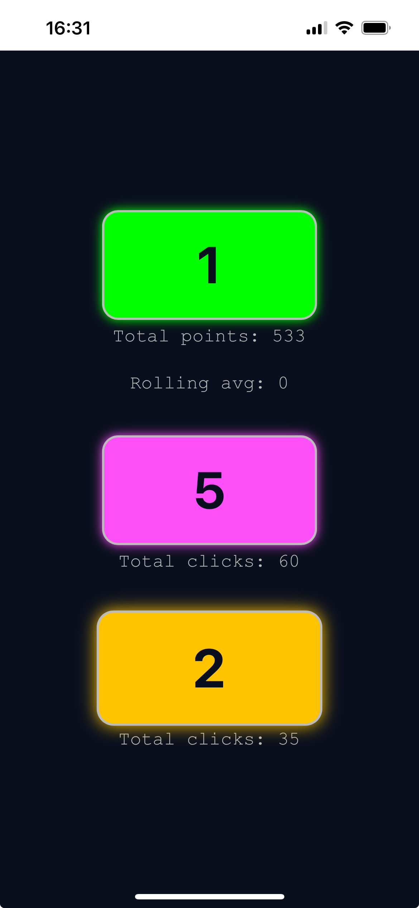

# clicker-counter-app

A simple web app to demonstrate self-hosting and a basic CI/CD process for a mobile-friendly PWA.

The app runs on an Oracle Cloud VM inside a Docker container. It’s built as a Progressive Web App (PWA) so it can be easily installed on mobile devices.

A GitHub webhook is used to detect pushes to the remote repo. When triggered, the Docker container is rebuilt, allowing changes to be automatically deployed to the live app — a simple CI/CD setup for personal use.

The app itself is a basic clicker-counter, designed for crowd control at events. Multiple devices can contribute to a shared tally via a common database.

---

## Tasks

- [/] Host a simplified version of the app, accessible by HTTP (example available on http://193.123.185.59:8077/)
- [/] Complete the front-end and back-end  
- [/] Add a bash script to tear down and rebuild the Docker container  
- [/] Update to meet PWA requirements (e.g. HTTPS)  
- [ ] Add a webhook for auto-updates so changes can be deployed automatically  

---

## Installation of the hosted demo
This is an example hosting of the app and uses a common database. So this won't be a useful version of the app to use (see 'Installation instructions for self-hosting' for that), but this will provide a demo for how the app works.
The following instructions work on iOS devices, but a similar installation process is available on Android.
1. In Safari, navigate to https://click.portfoliofennelly.uk
2. Via the share button, select 'Add to Home Screen'. You can then select the app name.
3. This will provide a native app experience - clicking on the app will open this in a dedicated window (i.e., not as another tab in the web broswer app).
<p align="center">
  
</p>


## Installation instructions for self-hosting

1. Clone the repo to your host machine  
2. Ensure the following are installed: Docker, sqlite3, python3  
3. Make the bash scripts executable:

    ```bash
    chmod +x ./deploy.sh
    chmod +x ./webhook-deploy.sh
    ```

4. Open the correct port (e.g. 8077):
   - On the VM:

     ```bash
     sudo ufw allow 8087
     ```

   - On the cloud subnet: allow traffic to port 8077 from `0.0.0.0/0`

5. Update Nginx config to proxy to the app (TODO: add details)

6. Run the deployment script:

    ```bash
    ./deploy.sh
    ```

    This builds the Docker container. Check it’s running:

    ```bash
    docker ps -a | grep clicker-counter-app
    ```

7. Visit `http://<your-ip>:8077` from another device. On mobile, you can select *"Add to Home Screen"* to install the PWA and get a more native app experience.

---

## Webhook setup

1. Go to your GitHub repo → Settings → Webhooks  
2. Add a new webhook:
   - Trigger on: **Push events**
   - Payload URL: `http://<your-ip>:<webhook-port>` (TBC)
   - Content type: `application/json`

3. Run the webhook listener:

    ```bash
    ./webhook-deploy.sh
    ```

    Check it’s running:

    ```bash
    docker ps -a | grep webhook-listener-clicker
    ```

With the webhook in place, any push to the repo will trigger a rebuild and redeploy — no need to manually log in to the VM.

---
